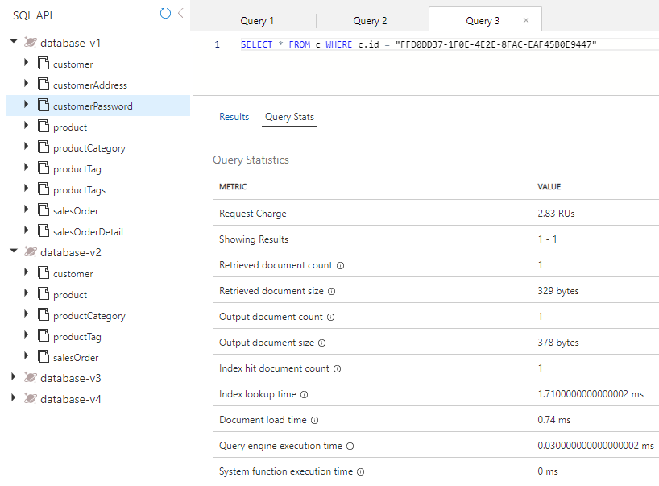

---
lab:
  title: 별도의 컨테이너 및 포함 컨테이너에서 엔터티 성능 측정
  module: Module 8 - Implement a data modeling and partitioning strategy for Azure Cosmos DB SQL API
ms.openlocfilehash: b3f7be3d3f7674fc19b2823de50d013e3bd4b04d
ms.sourcegitcommit: b90234424e5cfa18d9873dac71fcd636c8ff1bef
ms.translationtype: HT
ms.contentlocale: ko-KR
ms.lasthandoff: 01/12/2022
ms.locfileid: "138025029"
---
# <a name="measure-performance-of-entities-in-separate-and-embeded-containers"></a>별도의 컨테이너 및 포함 컨테이너에서 엔터티 성능 측정

이번 연습에서는 엔터티를 별도의 컨테이너로 모델링할 때와 엔터티를 단일 문서에 포함하는 NoSQL 데이터베이스로 모델링할 때를 비교하여 고객 엔터티에 대한 차이를 측정합니다.

## <a name="prepare-your-development-environment"></a>개발 환경 준비

**DP-420** 에 대한 랩 코드 리포지토리를 이 랩에서 작업 중인 환경에 아직 복제하지 않은 경우 다음 단계를 수행합니다. 그렇지 않으면 이전에 복제한 폴더를 **Visual Studio Code** 에서 엽니다.

1. **Visual Studio Code** 를 시작합니다.

    > &#128221; Visual Studio Code 인터페이스에 익숙하지 않은 경우 [Visual Studio Code 시작 가이드][code.visualstudio.com/docs/getstarted]를 검토하세요.

1. 명령 팔레트를 열고 **Git: Clone** 을 실행하여 선택한 로컬 폴더에 ``https://github.com/microsoftlearning/dp-420-cosmos-db-dev`` GitHub 리포지토리를 복제합니다.

    > &#128161; **CTRL+SHIFT+P** 바로 가기 키를 사용하여 명령 팔레트를 열 수 있습니다.

1. 리포지토리가 복제되면 **Visual Studio Code** 에서 선택한 로컬 폴더를 엽니다.

1. **Visual Studio Code** 의 **탐색기** 창에서 **16-measure-performance** 폴더를 찾아봅니다.

1. **16-measure-performance** 폴더의 상황에 맞는 메뉴를 연 다음, **통합 터미널에서 열기** 를 선택하여 새 터미널 인스턴스를 엽니다.

1. 터미널이 **Windows Powershell** 터미널로 열리면 새 **Git Bash** 터미널을 엽니다.

    > &#128161; **Git Bash** 터미널을 열려면 터미널 메뉴의 오른쪽에서 **+** 기호 옆에 있는 풀다운을 클릭하고 *Git Bash* 를 선택합니다.

1. **Git Bash 터미널** 에서 다음 명령을 실행합니다. 명령은 제공된 랩 자격 증명을 사용하는 Azure Portal에 연결하기 위해 브라우저 창을 열고 새 Azure Cosmos DB 계정을 만드는 스크립트를 실행한 다음, 데이터베이스를 채우고 연습을 완료하는 데 사용하는 앱을 빌드하고 시작합니다. 일단 스크립트가 Azure 계정에 대해 제공된 자격 증명을 요청하면 빌드를 완료하는 데 15~20분이 걸릴 수 있으므로 커피나 차를 마시며 기다리는 것이 좋을 것 같습니다.

    ```
    az login
    cd 16-measure-performance
    bash init.sh
    dotnet add package Microsoft.Azure.Cosmos --version 3.22.1
    dotnet build
    dotnet run --load-data

    ```

1. 통합 터미널을 닫습니다.

## <a name="measure-performance-of-entities-in-separate-containers"></a>별도의 컨테이너에서 엔터티의 성능 측정

Database-v1에서 데이터는 개별 컨테이너에 저장됩니다. 해당 데이터베이스에서 쿼리를 실행하여 고객, 고객 주소 및 고객 암호를 가져옵니다. 각 쿼리에 대한 요청 요금을 검토합니다.

### <a name="query-for-customer-entity"></a>고객 엔터티에 대한 쿼리

Database-v1에서 쿼리를 실행하여 고객 엔터티를 가져오고 요청 요금을 검토합니다.

1. 새 웹 브라우저 창 또는 탭에서 Azure Portal(``portal.azure.com``)로 이동합니다.

1. 구독과 연결된 Microsoft 자격 증명을 사용하여 포털에 로그인합니다.

1. Azure Portal 메뉴 또는 **홈** 페이지에서 **Azure Cosmos DB** 를 선택합니다.
1. **cosmicworks** 로 시작하는 이름이 있는 Azure Cosmos DB 계정을 선택합니다.
1. 왼쪽에서 **데이터 탐색기** 를 선택합니다.
1. **Database-v1** 을 확장합니다.
1. **Customer** 컨테이너를 선택합니다.
1. 화면 맨 위에서 **새 SQL 쿼리** 를 선택합니다.
1. 다음 SQL 텍스트를 복사하여 붙여넣고 **쿼리 실행** 을 선택합니다.

    ```
    SELECT * FROM c WHERE c.id = "FFD0DD37-1F0E-4E2E-8FAC-EAF45B0E9447"
   ```

1. **쿼리 통계** 탭을 선택하고 2.83의 요청 요금을 확인합니다.

    

### <a name="query-for-customer-address"></a>고객 주소에 대한 쿼리

쿼리를 실행하여 고객 주소 엔터티를 가져오고 요청 요금을 검토합니다.

1. **CustomerAddress** 컨테이너를 선택합니다.
1. 화면 맨 위에서 **새 SQL 쿼리** 를 선택합니다.
1. 다음 SQL 텍스트를 복사하여 붙여넣고 **쿼리 실행** 을 선택합니다.

    ```
    SELECT * FROM c WHERE c.customerId = "FFD0DD37-1F0E-4E2E-8FAC-EAF45B0E9447"
   ```

1. **쿼리 통계** 탭을 선택하고 2.83의 요청 요금을 확인합니다.

    

### <a name="query-for-customer-password"></a>고객 암호 쿼리

쿼리를 실행하여 고객 암호 엔터티를 가져오고 요청 요금을 검토합니다.

1. **CustomerPassword** 컨테이너를 선택합니다.
1. 화면 맨 위에서 **새 SQL 쿼리** 를 선택합니다.
1. 다음 SQL 텍스트를 복사하여 붙여넣고 **쿼리 실행** 을 선택합니다.

    ```
    SELECT * FROM c WHERE c.id = "FFD0DD37-1F0E-4E2E-8FAC-EAF45B0E9447"
   ```

1. **쿼리 통계** 탭을 선택하고 2.83의 요청 요금을 확인합니다.

    

### <a name="add-up-the-request-charges"></a>요청 요금 합산

모든 쿼리를 실행했으므로 이제 해당 쿼리에 대한 모든 요청 단위 비용을 합산합니다.

|**쿼리**|**RU/s 비용**|
|---------|---------|
|고객|2.83|
|Customer Address|2.83|
|Customer Password|2.83|
|**총 RU/s**|**8.49**|

## <a name="measure-performance-of-embedded-entities"></a>포함된 엔터티의 성능 측정

이제 동일한 정보를 쿼리합니다. 다만 이번에는 엔터티가 단일 문서에 포함되어 있습니다.

1. **Database-v2** 데이터베이스를 선택합니다.
1. **Customer** 컨테이너를 선택합니다.
1. 다음 쿼리를 실행합니다.

    ```
    SELECT * FROM c WHERE c.id = "FFD0DD37-1F0E-4E2E-8FAC-EAF45B0E9447"
   ```

1. 반환되는 데이터는 이제 고객, 주소, 암호 데이터의 계층 구조입니다.

    

1. **쿼리 통계** 를 선택합니다. 앞서 실행한 세 개의 쿼리에 대한 8.49RU/s 대비 2.83의 요청 요금을 확인합니다.

## <a name="compare-the-performance-of-the-two-models"></a>두 모델의 성능 비교

실행한 각 쿼리에 대한 RU/s를 비교해 보면, 고객 엔터티가 단일 문서에 있는 마지막 쿼리를 실행하는 비용이 세 개의 쿼리를 독립적으로 실행하는 데 드는 총비용보다 훨씬 저렴하다는 것을 알 수 있습니다. 단일 작업으로 데이터를 반환하기 때문에 해당 데이터를 반환하는 데 드는 대기 시간이 단축됩니다.

검색 대상이 단일 항목이고 데이터의 파티션 키와 ID를 알고 있는 경우, Azure Cosmos DB SDK에서 `ReadItemAsync()`를 호출하여 *point-read* 를 통해 해당 데이터를 검색할 수 있습니다. point-read가 쿼리보다 훨씬 빠릅니다. 동일한 고객 데이터의 경우 비용은 거의 3배 향상된 1RU/s입니다.

[code.visualstudio.com/docs/getstarted]: https://code.visualstudio.com/docs/getstarted/tips-and-tricks
