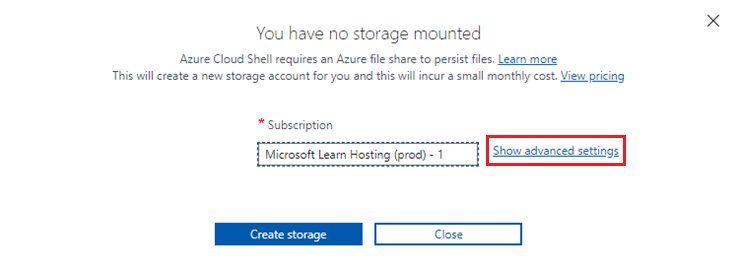
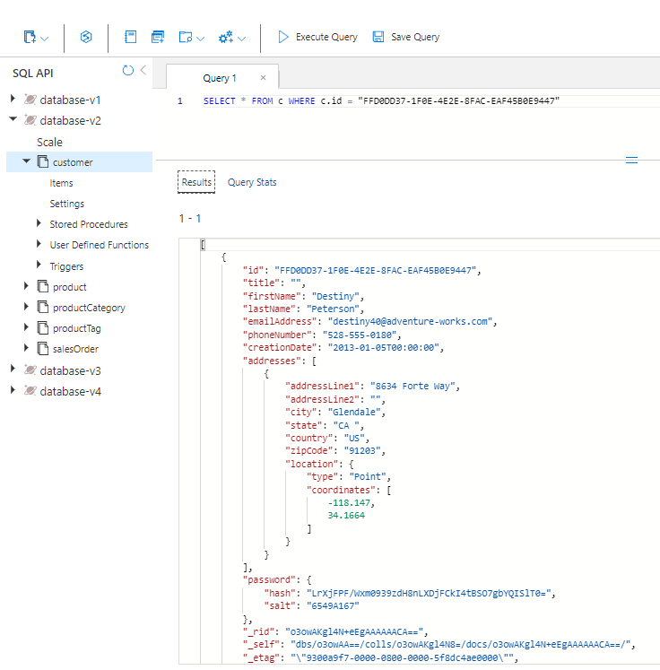

---
lab:
  title: 별도의 컨테이너 및 포함 컨테이너에서 엔터티 성능 측정
  module: Module 8 - Implement a data modeling and partitioning strategy for Azure Cosmos DB SQL API
ms.openlocfilehash: cbbb77c27e8ac3503046211fe047e8bd6a9756b3
ms.sourcegitcommit: e2c44650d91ce5b92b82d1357b43c254c0691471
ms.translationtype: HT
ms.contentlocale: ko-KR
ms.lasthandoff: 04/13/2022
ms.locfileid: "141674629"
---
# <a name="measure-performance-of-entities-in-separate-and-embedded-containers"></a>별도의 컨테이너 및 포함 컨테이너에서 엔터티 성능 측정

이번 연습에서는 엔터티를 별도의 컨테이너로 모델링할 때와 엔터티를 단일 문서에 포함하는 NoSQL 데이터베이스로 모델링할 때를 비교하여 고객 엔터티에 대한 차이를 측정합니다.

## <a name="prepare-your-development-environment"></a>개발 환경 준비

이 랩에서 작업 중인 Azure Cosmos DB 데이터베이스를 아직 준비하지 않은 경우 다음 단계를 수행하여 준비합니다. 그렇지 않으면 **별도의 컨테이너에서 엔터티의 성능 측정** 섹션으로 이동합니다.

1. 새 웹 브라우저 창 또는 탭에서 Azure Portal(``portal.azure.com``)로 이동합니다.

1. 제공한 Azure 자격 증명을 사용하여 로그인합니다.

1. 이 랩에서는 Azure Cloud Shell 터미널을 사용하여 샘플 데이터를 로드하지만, 이 작업을 하려면 먼저 Azure Cloud Shell에서 추가된 Azure Storage 계정이 작동해야 합니다. 기존에 사용 가능한 스토리지 계정이 없는 경우 계정을 만들어야 합니다.  Azure Cloud Shell에 대한 액세스 권한이 이미 있는 경우 이 단계를 건너뛸 수 있습니다.

    1. **리소스 만들기** 옵션을 선택하여 리소스를 만듭니다.

    1. **스토리지 계정** 을 검색합니다.

    1. 목록에서 **스토리지 계정** 을 선택하고 **만들기** 를 선택합니다.

    1. 아직 선택하지 않은 경우 올바른 구독 및 리소스 그룹을 선택합니다. 

    1. 소문자와 숫자를 사용하여 스토리지 계정 이름으로 고유한 이름을 선택합니다.  리소스 그룹 이름이 충분히 고유한 경우 스토리지 계정 이름으로도 사용할 수 있습니다.  다른 모든 옵션을 기본값으로 유지합니다.

        > &#128221; 이 스토리지 계정을 만드는 지역을 기록해 둡니다. 아래에서 처음으로 Azure Cloud Shell을 설정하는 경우 동일한 지역을 선택해야 합니다.

    1. **검토 + 만들기** 를 선택하고 유효성 검사가 통과되면 **만들기** 를 선택합니다.

1. Azure Cloud Shell이 이미 설정되었으면 **Bash** 모드에서 열고, 그렇지 않으면 다음 지침을 사용하여 처음으로 설정합니다.

    

    1. **Azure Cloud Shell** 단추를 선택하여 엽니다.

    1. **Bash** 모드를 선택합니다.

        
 
    1. 이 Azure 계정으로 Azure Cloud Shell을 처음 실행하는 경우 Azure Storage 계정을 이 Cloud Shell에 연결해야 합니다.  **고급 설정 표시** 를 선택하여 스토리지 계정을 연결합니다. 

        
 
    1. 올바른 구독 및 지역을 선택합니다.  **리소스 그룹** 및 **스토리지 계정** 에서 **기존 항목 사용** 을 선택하고 올바른 리소스 그룹과 스토리지 계정을 선택합니다.  **파일 공유** 에서 해당 스토리지 계정으로 공유에 고유한 이름을 지정합니다. **스토리지 만들기** 를 선택하여 Cloud Shell 설정을 완료합니다.

        
 
1. **Azure Cloud Shell Bash 터미널** 에서 다음 명령을 실행합니다. 이 명령은 새 Azure Cosmos DB 계정을 만드는 스크립트를 실행한 다음, 데이터베이스를 채우고 연습을 완료하는 데 사용하는 앱을 빌드하고 시작합니다. 빌드를 완료하는 데 15~20분이 걸릴 수 있으므로 커피나 차를 마시며 기다리는 것이 좋을 것 같습니다.

    ```
    git clone https://github.com/microsoftlearning/dp-420-cosmos-db-dev
    cd dp-420-cosmos-db-dev/16-measure-performance
    bash init.sh
    dotnet add package Microsoft.Azure.Cosmos --version 3.22.1
    dotnet build
    dotnet run --load-data

    ```

1. Cloud Shell 터미널을 닫습니다.

## <a name="measure-performance-of-entities-in-separate-containers"></a>별도의 컨테이너에서 엔터티의 성능 측정

Database-v1에서 데이터는 개별 컨테이너에 저장됩니다. 해당 데이터베이스에서 쿼리를 실행하여 고객, 고객 주소 및 고객 암호를 가져옵니다. 각 쿼리에 대한 요청 요금을 검토합니다.

### <a name="query-for-customer-entity"></a>고객 엔터티에 대한 쿼리

Database-v1에서 쿼리를 실행하여 고객 엔터티를 가져오고 요청 요금을 검토합니다.

1. 아직 열리지 않은 경우 새 웹 브라우저 창 또는 탭에서 Azure Portal(``portal.azure.com``)로 이동합니다.

1. 구독과 연결된 Microsoft 자격 증명을 사용하여 포털에 로그인합니다.

1. Azure Portal 메뉴 또는 **홈** 페이지에서 **Azure Cosmos DB** 를 선택합니다.

1. **cosmicworks** 로 시작하는 이름이 있는 Azure Cosmos DB 계정을 선택합니다.

1. 왼쪽에서 **데이터 탐색기** 를 선택합니다.

1. **Database-v1** 을 확장합니다.

1. **Customer** 컨테이너를 선택합니다.

1. 화면 맨 위에서 **새 SQL 쿼리** 를 선택합니다.

1. 다음 SQL 텍스트를 복사하여 붙여넣고 **쿼리 실행** 을 선택합니다.

    ```
    SELECT * FROM c WHERE c.id = "FFD0DD37-1F0E-4E2E-8FAC-EAF45B0E9447"
   ```

1. **쿼리 통계** 탭을 선택하고 2.83의 요청 요금을 확인합니다.

    

### <a name="query-for-customer-address"></a>고객 주소에 대한 쿼리

쿼리를 실행하여 고객 주소 엔터티를 가져오고 요청 요금을 검토합니다.

1. **CustomerAddress** 컨테이너를 선택합니다.

1. 화면 맨 위에서 **새 SQL 쿼리** 를 선택합니다.

1. 다음 SQL 텍스트를 복사하여 붙여넣고 **쿼리 실행** 을 선택합니다.

    ```
    SELECT * FROM c WHERE c.customerId = "FFD0DD37-1F0E-4E2E-8FAC-EAF45B0E9447"
   ```

1. **쿼리 통계** 탭을 선택하고 2.83의 요청 요금을 확인합니다.

    

### <a name="query-for-customer-password"></a>고객 암호 쿼리

쿼리를 실행하여 고객 암호 엔터티를 가져오고 요청 요금을 검토합니다.

1. **CustomerPassword** 컨테이너를 선택합니다.

1. 화면 맨 위에서 **새 SQL 쿼리** 를 선택합니다.

1. 다음 SQL 텍스트를 복사하여 붙여넣고 **쿼리 실행** 을 선택합니다.

    ```
    SELECT * FROM c WHERE c.id = "FFD0DD37-1F0E-4E2E-8FAC-EAF45B0E9447"
   ```

1. **쿼리 통계** 탭을 선택하고 2.83의 요청 요금을 확인합니다.

    

### <a name="add-up-the-request-charges"></a>요청 요금 합산

모든 쿼리를 실행했으므로 이제 해당 쿼리에 대한 모든 요청 단위 비용을 합산합니다.

|**쿼리**|**RU/s 비용**|
|---------|---------|
|고객|2.83|
|Customer Address|2.83|
|Customer Password|2.83|
|**총 RU/s**|**8.49**|

## <a name="measure-performance-of-embedded-entities"></a>포함된 엔터티의 성능 측정

이제 동일한 정보를 쿼리합니다. 다만 이번에는 엔터티가 단일 문서에 포함되어 있습니다.

1. **Database-v2** 데이터베이스를 선택합니다.

1. **Customer** 컨테이너를 선택합니다.

1. 다음 쿼리를 실행합니다.

    ```
    SELECT * FROM c WHERE c.id = "FFD0DD37-1F0E-4E2E-8FAC-EAF45B0E9447"
   ```

1. 반환되는 데이터는 이제 고객, 주소, 암호 데이터의 계층 구조입니다.

    

1. **쿼리 통계** 를 선택합니다. 앞서 실행한 세 개의 쿼리에 대한 8.49RU/s 대비 2.83의 요청 요금을 확인합니다.

## <a name="compare-the-performance-of-the-two-models"></a>두 모델의 성능 비교

실행한 각 쿼리에 대한 RU/s를 비교해 보면, 고객 엔터티가 단일 문서에 있는 마지막 쿼리를 실행하는 비용이 세 개의 쿼리를 독립적으로 실행하는 데 드는 총비용보다 훨씬 저렴하다는 것을 알 수 있습니다. 단일 작업으로 데이터를 반환하기 때문에 해당 데이터를 반환하는 데 드는 대기 시간이 단축됩니다.

검색 대상이 단일 항목이고 데이터의 파티션 키와 ID를 알고 있는 경우, Azure Cosmos DB SDK에서 `ReadItemAsync()`를 호출하여 *point-read* 를 통해 해당 데이터를 검색할 수 있습니다. point-read가 쿼리보다 훨씬 빠릅니다. 동일한 고객 데이터의 경우 비용은 거의 3배 향상된 1RU/s입니다.
