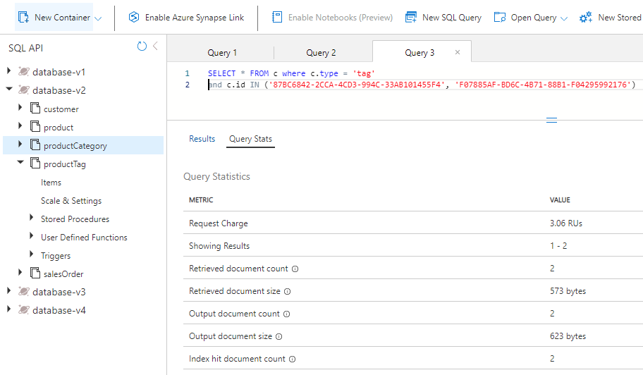
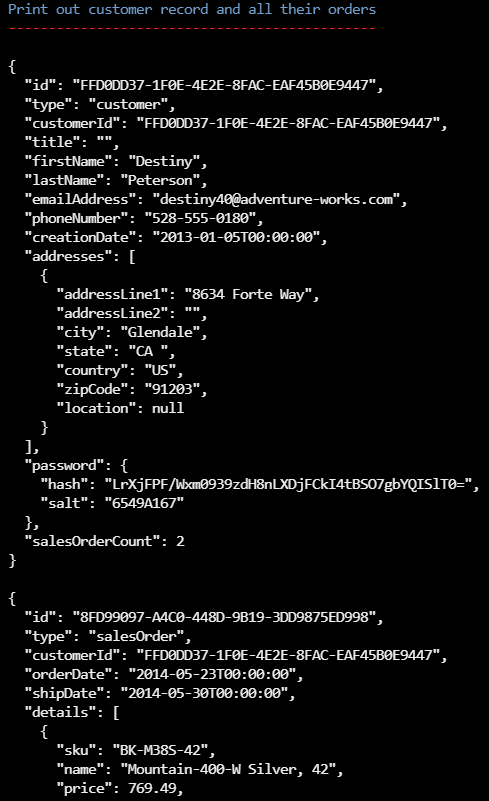
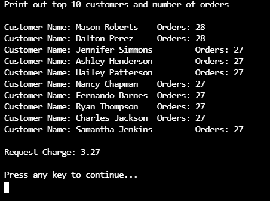

---
lab:
  title: 참조 무결성을 위해 데이터 및 집계를 비정규화하고 변경 피드를 사용하는 비용
  module: Module 8 - Implement a data modeling and partitioning strategy for Azure Cosmos DB SQL API
ms.openlocfilehash: dab2ec1b5ba4eb1fd317a039aa6db346cfae0d3d
ms.sourcegitcommit: e2c44650d91ce5b92b82d1357b43c254c0691471
ms.translationtype: HT
ms.contentlocale: ko-KR
ms.lasthandoff: 04/13/2022
ms.locfileid: "141674648"
---
# <a name="cost-of-denormalizing-data-and-aggregates-and-using-the-change-feed-for-referential-integrity"></a>참조 무결성을 위해 데이터 및 집계를 비정규화하고 변경 피드를 사용하는 비용

관계형 모델을 사용하면 다른 엔터티를 각자의 컨테이너에 배치할 수 있습니다.  그러나 NoSQL 데이터베이스에는 컨테이너 간에 조인이 없으므로 조인 사용을 제거하기 위해 데이터 비정규화를 시작해야 합니다.  또한 NoSQL은 데이터를 모델링함으로써 요청 수를 줄여 애플리케이션이 가능한 한 적은 수의 요청으로 데이터를 가져올 수 있도록 합니다. 데이터를 비정규화할 때 발생하는 한 가지 문제는 엔터티 간의 참조 무결성일 수 있습니다. 이를 위해 데이터의 동기화 상태를 유지하도록 변경 피드를 사용할 수 있습니다. 개수별로 그룹화와 같은 집계를 비정규화하면 요청 수를 줄이는 데도 도움이 될 수 있습니다.  

이 랩에서는 데이터 및 집계를 비정규화하는 것이 비용을 절감하는 데 도움이 되는 이점과 변경 피드를 사용하여 비정규화된 데이터에 대한 참조 무결성을 유지 관리하는 방법의 이점을 살펴봅니다.

## <a name="prepare-your-azure-cosmos-db-database-environment"></a>Azure Cosmos DB 데이터베이스 환경 준비

이 랩에서 작업 중인 Azure Cosmos DB 데이터베이스를 아직 준비하지 않은 경우 다음 단계를 수행하여 준비합니다. 그렇지 않으면 **데이터를 비정규화할 때 성능 비용 측정** 섹션으로 이동합니다.

1. 새 웹 브라우저 창 또는 탭에서 Azure Portal(``portal.azure.com``)로 이동합니다.

1. 제공한 Azure 자격 증명을 사용하여 로그인합니다.

1. 이 랩에서는 Azure Cloud Shell 터미널을 사용하여 샘플 데이터를 로드하지만, 이 작업을 하려면 먼저 Azure Cloud Shell에서 추가된 Azure Storage 계정이 작동해야 합니다. 기존에 사용 가능한 스토리지 계정이 없는 경우 계정을 만들어야 합니다.  Azure Cloud Shell에 대한 액세스 권한이 이미 있는 경우 이 단계를 건너뛸 수 있습니다.

    1. **리소스 만들기** 옵션을 선택하여 리소스를 만듭니다.

    1. **스토리지 계정** 을 검색합니다.

    1. 목록에서 **스토리지 계정** 을 선택하고 **만들기** 를 선택합니다.

    1. 아직 선택하지 않은 경우 올바른 구독 및 리소스 그룹을 선택합니다. 

    1. 소문자와 숫자를 사용하여 스토리지 계정 이름으로 고유한 이름을 선택합니다.  리소스 그룹 이름이 충분히 고유한 경우 스토리지 계정 이름으로도 사용할 수 있습니다.  다른 모든 옵션을 기본값으로 유지합니다.

        > &#128221; 이 스토리지 계정을 만드는 지역을 기록해 둡니다. 아래에서 처음으로 Azure Cloud Shell을 설정하는 경우 동일한 지역을 선택해야 합니다.

   1. **검토 + 만들기** 를 선택하고 유효성 검사가 통과되면 **만들기** 를 선택합니다.

1. Azure Cloud Shell이 이미 설정되었으면 **Bash** 모드에서 열고, 그렇지 않으면 다음 지침을 사용하여 처음으로 설정합니다.

    

    1. **Azure Cloud Shell** 단추를 선택하여 엽니다.

    1. **Bash** 모드를 선택합니다.

        
 
    1. 이 Azure 계정으로 Azure Cloud Shell을 처음 실행하는 경우 Azure Storage 계정을 이 Cloud Shell에 연결해야 합니다.  **고급 설정 표시** 를 선택하여 스토리지 계정을 연결합니다. 

        
 
    1. 올바른 구독 및 지역을 선택합니다.  **리소스 그룹** 및 **스토리지 계정** 에서 **기존 항목 사용** 을 선택하고 올바른 리소스 그룹과 스토리지 계정을 선택합니다.  **파일 공유** 에서 해당 스토리지 계정으로 공유에 고유한 이름을 지정합니다. **스토리지 만들기** 를 선택하여 Cloud Shell 설정을 완료합니다.

        
 
 1. **Azure Cloud Shell Bash 터미널** 에서 다음 명령을 실행합니다. 이 명령은 새 Azure Cosmos DB 계정을 만드는 스크립트를 실행한 다음, 데이터베이스를 채우고 연습을 완료하는 데 사용하는 앱을 빌드하고 시작합니다. 빌드를 완료하는 데 15~20분이 걸릴 수 있으므로 커피나 차를 마시며 기다리는 것이 좋을 것 같습니다.

    ```
    git clone https://github.com/microsoftlearning/dp-420-cosmos-db-dev
    cd dp-420-cosmos-db-dev/17-denormalize
    bash init.sh
    dotnet add package Microsoft.Azure.Cosmos --version 3.22.1
    dotnet build
    dotnet run --load-data

    ```

1. Cloud Shell 터미널을 닫습니다. **Azure Portal을 닫지 마세요**.

1. Azure Portal에서 위의 단계에서 만든 새 Azure Cosmos DB 계정으로 이동합니다.

1. **_Keys_* _ 섹션 아래 **URI** 및 **기본 키** 를 기록합니다.  _appSettings.json* 파일을 아래 해당 값으로 업데이트합니다.

## <a name="prepare-your-development-environment"></a>개발 환경 준비

**DP-420** 에 대한 랩 코드 리포지토리를 이 랩에서 작업 중인 환경에 아직 복제하지 않은 경우 다음 단계를 수행합니다. 그렇지 않으면 이전에 복제한 폴더를 **Visual Studio Code** 에서 엽니다.

1. **Visual Studio Code** 를 시작합니다.

    > &#128221; Visual Studio Code 인터페이스에 익숙하지 않은 경우 [Visual Studio Code 시작 가이드][code.visualstudio.com/docs/getstarted]를 검토하세요.

1. 명령 팔레트를 열고 **Git: Clone** 을 실행하여 선택한 로컬 폴더에 ``https://github.com/microsoftlearning/dp-420-cosmos-db-dev`` GitHub 리포지토리를 복제합니다.

    > &#128161; **CTRL+SHIFT+P** 바로 가기 키를 사용하여 명령 팔레트를 열 수 있습니다.

1. 리포지토리가 복제되면 **Visual Studio Code** 에서 선택한 로컬 폴더를 엽니다.

1. **Visual Studio Code** 에서 *17-denormalize* 폴더에 있는 *appSettings.json* 파일을 엽니다.

1. *CosmosDBAccountURI* 및 *CosmosDBAccountKey* 를 이전에 기록한 해당 값으로 바꿉니다.

1. Ctrl+S를 선택하여 변경 내용을 저장합니다.

## <a name="exercise-1-measure-performance-cost-when-denormalizing-data"></a>연습 1: 데이터를 비정규화할 때 성능 비용 측정

### <a name="query-for-the-product-category-name"></a>제품 범주 이름에 대한 쿼리

데이터가 개별 컨테이너에 저장되는 **database-v2** 컨테이너에서 쿼리를 실행하여 제품 범주 이름을 가져옵니다. 그런 다음 해당 쿼리에 대한 요청 요금을 확인합니다.

1. 아직 열리지 않은 경우 새 웹 브라우저 창 또는 탭에서 Azure Portal(``portal.azure.com``)로 이동합니다.

1. 구독과 연결된 Microsoft 자격 증명을 사용하여 포털에 로그인합니다.

1. 왼쪽 창에서 **Azure Cosmos DB** 를 선택합니다.

1. **cosmicworks** 로 시작하는 이름의 Azure Cosmos DB 계정을 선택합니다.

1. 왼쪽 창에서 **데이터 탐색기** 를 선택합니다.

1. **database-v2** 를 확장합니다.

1. **productCategory** 컨테이너를 선택합니다.

1. 페이지 맨 위에서 **새 SQL 쿼리** 를 선택합니다.

1. **쿼리 1** 창에서 다음 SQL 코드를 붙여 넣은 다음, **쿼리 실행** 을 선택합니다.

    ```
    SELECT * FROM c where c.type = 'category' and c.id = "AB952F9F-5ABA-4251-BC2D-AFF8DF412A4A"
    ```

1. **결과** 탭을 선택하여 결과를 검토합니다. 이 쿼리는 “Component, Headsets”라는 제품 범주의 이름을 반환합니다.

    

1. **쿼리 통계** 탭을 선택하고 2.93RU(요청 단위)의 요청 요금을 적어 둡니다.

    

### <a name="query-for-the-products-in-the-category"></a>범주의 제품에 대한 쿼리

이제 제품 컨테이너를 쿼리하여 “Components, Headsets” 범주에 대한 모든 제품을 가져옵니다.

1. **product** 컨테이너를 선택합니다.

1. 페이지 맨 위에서 **새 SQL 쿼리** 를 선택합니다.

1. **쿼리 2** 창에서 다음 SQL 코드를 붙여 넣은 다음, **쿼리 실행** 을 선택합니다.

    ```
    SELECT * FROM c where c.categoryId = "AB952F9F-5ABA-4251-BC2D-AFF8DF412A4A"
    ```

1. **결과** 탭을 선택하여 결과를 검토합니다. HL Headset, LL Headset, ML Headset의 세 가지 제품이 반환됩니다. 각 제품에는 SKU, 이름, 가격, 제품 태그 배열이 있습니다.

1. **쿼리 통계** 탭을 선택하고 요청 요금 2.9RU를 적어 둡니다.

    

### <a name="query-for-each-products-tags"></a>각 제품의 태그에 대한 쿼리

다음으로, HL Headset, LL Headset, ML Headset의 세 가지 제품 각각에 대해 productTag 컨테이너를 각 한 번씩 세 번 쿼리합니다.

#### <a name="hl-headset-tags"></a>HL Headset 태그

먼저, HL Headset에 대한 태그를 반환하는 쿼리를 실행합니다.

1. **productTag** 컨테이너를 선택합니다.

1. 페이지 맨 위에서 **새 SQL 쿼리** 를 선택합니다.

1. **쿼리 3** 창에서 다음 SQL 코드를 붙여 넣은 다음, **쿼리 실행** 을 선택합니다.

    ```
    SELECT * FROM c where c.type = 'tag' and c.id IN ('87BC6842-2CCA-4CD3-994C-33AB101455F4', 'F07885AF-BD6C-4B71-88B1-F04295992176')
    ```

    이 쿼리는 HL Headset 제품에 대한 두 개의 태그를 반환합니다.

1. **쿼리 통계** 탭을 선택하고 3.06RU의 요청 요금을 기록해 둡니다.

    

#### <a name="ll-headset-tags"></a>LL Headset 태그

그런 다음, LL Headset에 대한 태그를 반환하는 쿼리를 실행합니다.

1. **productTag** 컨테이너를 선택합니다.

1. 페이지 맨 위에서 **새 SQL 쿼리** 를 선택합니다.

1. **쿼리 4** 창에서 다음 SQL 코드를 붙여 넣은 다음, **쿼리 실행** 을 선택합니다.

    ```
    SELECT * FROM c where c.type = 'tag' and c.id IN ('18AC309F-F81C-4234-A752-5DDD2BEAEE83', '1B387A00-57D3-4444-8331-18A90725E98B', 'C6AB3E24-BA48-40F0-A260-CB04EB03D5B0', 'DAC25651-3DD3-4483-8FD1-581DC41EF34B', 'E6D5275B-8C42-47AE-BDEC-FC708DB3E0AC')
    ```

    이 쿼리는 LL Headset 제품에 대한 다섯 개의 태그를 반환합니다.

1. **쿼리 통계** 탭을 선택하고 3.47RU의 요청 요금을 기록해 둡니다.

    

#### <a name="ml-headset-tags"></a>ML Headset 태그

마지막으로, ML Headset에 대한 태그를 반환하는 쿼리를 실행합니다.

1. **productTag** 컨테이너를 선택합니다.

1. 페이지 맨 위에서 **새 SQL 쿼리** 를 선택합니다.

1. **쿼리 5** 창에서 다음 SQL 코드를 붙여 넣은 다음, **쿼리 실행** 을 선택합니다.

    ```
    SELECT * FROM c where c.type = 'tag' and c.id IN ('A34D34F7-3286-4FA4-B4B0-5E61CCEEE197', 'BA4D7ABD-2E82-4DC2-ACF2-5D3B0DEAE1C1', 'D69B1B6C-4963-4E85-8FA5-6A3E1CD1C83B')
    ```

    이 쿼리는 ML Headset 제품에 대한 세 개의 태그를 반환합니다.

1. **쿼리 통계** 탭을 선택하고 요청 요금 3.2RU를 적어 둡니다.

    

### <a name="add-up-the-ru-charges"></a>RU 요금 합산

이제, 실행한 각 쿼리에서 모든 RU 비용을 합산해 보겠습니다.

| 쿼리 | RU 비용 |
| - | - |
| 범주 이름. | 2.93 |
| 제품 | 2.9 |
| HL 제품 태그 | 3.06 |
| LL 제품 태그 | 3.47 |
| ML 제품 태그 | 3.2 |
| **총 RU 비용** | **15.56** |
| | |

### <a name="run-the-same-queries-for-your-nosql-design"></a>NoSQL 디자인에 대해 동일한 쿼리 실행

이제 비정규화된 데이터베이스에서 동일한 정보를 쿼리합니다.

1. Data Explorer에서 **database-v3** 을 선택합니다.

1. **product** 컨테이너를 선택합니다.

1. 페이지 맨 위에서 **새 SQL 쿼리** 를 선택합니다.

1. **쿼리 6** 창에서 다음 SQL 코드를 붙여 넣은 다음, **쿼리 실행** 을 선택합니다.

    ```
   SELECT * FROM c where c.categoryId = "AB952F9F-5ABA-4251-BC2D-AFF8DF412A4A"
   ```

    결과는 다음 이미지와 비슷하게 표시됩니다.

    

1. 이 쿼리에서 반환된 데이터를 검토합니다. 여기에는 세 개의 각 제품에 대한 범주 이름 및 태그 이름을 포함하여, 이 범주의 제품을 렌더링하는 데 필요한 모든 정보가 포함되어 있습니다.

1. **쿼리 통계** 탭을 선택하고 요청 요금 2.9RU를 적어 둡니다.

### <a name="compare-the-performance-of-the-two-models"></a>두 모델의 성능 비교

데이터가 개별 컨테이너에 저장되는 관계형 모델에서 5개의 쿼리를 실행하여, 범주 이름, 해당 범주에 대한 모든 제품, 각 제품에 대한 모든 제품 태그를 가져왔습니다. 5개의 쿼리에 대한 요청 요금은 총 15.56 RU였습니다.

NoSQL 모델에서 동일한 정보를 얻기 위해, 요청 요금이 2.9RU인 쿼리 하나를 실행했습니다.

장점은 이 모델과 같은 NoSQL 디자인의 저렴한 비용만이 아닙니다. 이 디자인 유형은 단일 요청만 요구하기 때문에 속도도 더 빠릅니다. 또한, 데이터 자체는 웹 페이지에서 렌더링될 가능성이 높은 방식으로 제공됩니다. 즉, 전자상거래 애플리케이션에서 다운스트림을 작성하고 유지 관리해야 하는 코드가 줄어듭니다.

데이터를 비정규화할 경우 전자상거래 애플리케이션에 대해 더 간단하고 효율적인 쿼리가 생성됩니다. 애플리케이션에 필요한 모든 데이터를 단일 컨테이너에 저장하고, 단일 쿼리를 통해 가져올 수 있습니다. 동시성이 높은 쿼리를 처리할 때, 이러한 유형의 데이터 모델링은 단순성, 속도, 비용에 큰 장점을 제공할 수 있습니다.

---

## <a name="exercise-2-use-the-change-feed-to-manage-referential-integrity"></a>연습 2 - 변경 피드를 사용하여 참조 무결성 관리

이 단원에서는 변경 피드가 Azure Cosmos DB의 두 컨테이너 간에 참조 무결성을 유지 관리하는 방법을 알아봅니다. 이 시나리오에서는 변경 피드를 사용하여 productCategory 컨테이너를 수신 대기합니다. 제품 범주의 이름을 업데이트하면, 변경 피드는 업데이트된 이름을 캡처하고 해당 범주의 모든 제품을 새 이름으로 업데이트합니다.

이 연습에서는 다음 단계를 완료하게 됩니다.

- 몇 가지 C# 코드를 완료하여 이해해야 하는 주요 개념을 강조 표시합니다.
- productCategory 컨테이너의 수신 대기를 시작하도록 변경 피드 프로세서를 시작합니다.
- 제품 컨테이너에서 이름을 변경하려는 범주와 해당 범주의 제품 수를 쿼리합니다.
- 범주 이름을 업데이트하고 변경 피드가 변경 내용을 제품 컨테이너에 전파하는 것을 관찰합니다.
- 새 범주 이름으로 새 제품 컨테이너를 쿼리하고, 제품 수를 계산하여 모두 업데이트되었는지 확인합니다.
- 이름을 다시 원래대로 변경하고, 변경 피드가 변경 내용을 다시 전파하는 것을 관찰합니다.

### <a name="open-visual-studio-code"></a>Visual Studio Code를 엽니다.

변경 피드에 대해 업데이트할 코드로 이동하려면, 다음을 수행합니다.

1. 아직 열리지 않은 경우 Visual Studio Code를 열고 *17-denormalize* 폴더에서 *Program.cs* 파일을 엽니다.

### <a name="complete-the-code-for-change-feed"></a>변경 피드에 대한 코드 완료

대리자에 전달된 변경 사항을 처리하는 코드를 추가하고, 해당 범주의 각 제품을 반복하고 업데이트합니다.

1. 변경 피드 프로세서를 시작하는 함수로 이동합니다.

1. Ctrl+G를 선택한 다음, **603** 을 입력하여 파일의 해당 줄로 이동합니다.

1. 이제 다음 코드가 표시됩니다.

    

   줄 588과 589에 두 개의 컨테이너 참조가 있습니다. 올바른 컨테이너 이름으로 업데이트해야 합니다. 변경 피드는 컨테이너 참조에서 변경 피드 프로세서의 인스턴스를 생성하여 작동합니다. 이 경우, productCategory 컨테이너에 대한 변경 내용을 확인합니다.

1. 줄 588에서 **{container to watch}** 를 **productCategory** 로 바꿉니다.

1. 줄 589에서 **{container to watch}를** **product** 로 바꿉니다. 제품 범주 이름이 업데이트되면 해당 범주의 모든 제품을 새 제품 범주 이름으로 업데이트해야 합니다.

1. *container to watch* 및 *container to update* 줄 아래에서 *leaseContainer* 줄을 검토합니다. leaseContainer는 컨테이너의 검사점처럼 작동합니다. 변경 피드 프로세서에서 마지막으로 확인한 이후 업데이트된 내용을 알고 있습니다.
  
   변경 피드가 새 변경 내용을 발견하면, 대리자를 호출하고 읽기 전용 컬렉션으로 변경 내용을 전달합니다.

1. 줄 603에서는 변경 피드에 처리해야 할 새 변경 내용이 있을 때 호출될 일부 코드를 추가해야 합니다. 이렇게 하려면, 다음 코드 조각을 복사하여 `//To-Do:`로 시작하는 줄 아래에 붙여 넣습니다

    ```
    //Fetch each change to productCategory container
    foreach (ProductCategory item in input)
    {
        string categoryId = item.id;
        string categoryName = item.name;
    
        tasks.Add(UpdateProductCategoryName(productContainer, categoryId, categoryName));
    }
    ```

1. 이제 코드가 다음 이미지의 코드와 같이 표시됩니다.

    

    기본적으로 변경 피드는 매초 실행됩니다. 관찰된 컨테이너에서 삽입 또는 업데이트가 많이 수행되는 시나리오의 경우, 대리자는 둘 이상의 변경 내용을 포함할 수도 있습니다. 이러한 이유로 대리자 `input`을 `IReadOnlyCollection`로 입력합니다.

    이 코드 조각은 대리자 `input`의 모든 변경 내용을 반복하고 `categoryId` 및 `categoryName`에 대한 문자열로 저장합니다. 그런 다음 새 범주 이름으로 제품 컨테이너를 업데이트하는 다른 함수를 호출하여 작업 목록에 작업을 추가합니다.

1. Ctrl+G를 선택한 다음, **647** 을 입력하여 `UpdateProductCategoryName()` 함수를 찾습니다. 여기서는 변경 피드에 의해 캡처된 새 범주 이름으로 제품 컨테이너의 각 제품을 업데이트하는 약간의 코드를 작성합니다.

1. 다음 코드 조각을 복사하여 **//To-Do:** 로 시작하는 줄 아래에 붙여넣습니다. 함수는 두 작업을 수행합니다. 먼저 `categoryId`에서 전달된 모든 제품에 대한 제품 컨테이너를 쿼리합니다. 그런 다음 각 제품을 새 제품 범주 이름으로 업데이트합니다.

    ```
    //Loop through all products
    foreach (Product product in response)
    {
        productCount++;
        //update category name for product
        product.categoryName = categoryName;
    
        //write the update back to product container
        await productContainer.ReplaceItemAsync(
            partitionKey: new PartitionKey(categoryId),
            id: product.id,
            item: product);
    }
    ```

    이제 코드가 다음과 비슷할 것입니다.

    

    이 코드는 쿼리의 응답 개체에서 행을 읽은 다음, 쿼리에서 반환된 모든 제품으로 제품 컨테이너를 업데이트합니다.

    `foreach()` 루프를 사용하여 쿼리에서 반환되는 각 제품으로 진행합니다. 그런 다음, 각 행에 대해 업데이트된 제품 개수를 알 수 있도록 카운터를 업데이트합니다. 그런 다음, 제품의 범주 이름을 새 `categoryName`로 업데이트합니다. 마지막으로, `ReplaceItemAsync()`을 호출하여 제품 컨테이너에서 제품을 다시 업데이트합니다.

1. Ctrl+S를 선택하여 변경 내용을 저장합니다.

1. 아직 열리지 않은 경우 Git Bash 통합 터미널을 열고 *17-denormalize* 폴더에 있는지 확인합니다.

1. 프로젝트를 컴파일하고 실행하려면 다음 명령을 실행합니다.

    ```
    dotnet add package Microsoft.Azure.Cosmos --version 3.22.1
    dotnet build
    dotnet run
    ```

1. 이제 애플리케이션의의 주 메뉴가 화면에 표시됩니다.

    

### <a name="run-the-change-feed-sample"></a>변경 피드 샘플 실행

이제 변경 피드에 대한 코드를 완료했으므로 작동하는 모습을 살펴보겠습니다.

1. 주 메뉴에서 **a** 를 선택하여 변경 피드 프로세서를 시작합니다. 화면에 진행이 표시됩니다.

    

1. 아무 키나 눌러 주 메뉴로 돌아갑니다.

1. 주 메뉴에서 **b** 를 선택하여 제품 범주 이름을 업데이트합니다. 다음 시퀀스가 수행됩니다.

    a. “Accessories, Tires, and Tubes” 범주에 대한 제품 컨테이너를 쿼리하고 해당 범주에 속하는 제품 수를 계산합니다.  
    b. 해당 범주 이름을 업데이트하고, 단어 “and”를 앰퍼샌드 “&”로 바꿉니다.  
    c. 변경 피드는 해당 변경을 선택하고, 작성된 코드를 사용하여 해당 범주의 모든 제품을 업데이트합니다.  
    d. 그런 다음, 이름 변경을 되돌리고 범주 이름을 다시 변경하여 “&”를 이름의 원래 “and”로 바꿉니다.  
    e. 변경 피드는 해당 변경 내용을 선택하고 모든 제품을 원래 제품 범주 이름으로 다시 업데이트합니다.

1. 주 메뉴에서 **b** 를 선택하고 변경 피드가 두 번째로 실행될 때까지 표시되는 메시지를 따릅니다. 결과는 다음과 같이 나타납니다.

    

1. 너무 멀리 간 경우, 주 메뉴로 돌아가서 다시 **b** 를 선택하여 변경 내용을 관찰합니다.

1. 완료되면 **x** 를 입력하여 종료하고 Shell로 돌아갑니다.

---

## <a name="exercise-3-denormalizing-aggregates"></a>연습 3 - 집계 비정규화

이 단원에서는 집계의 비정규화를 사용하여 전자상거래 사이트에 대한 상위 10대 고객 쿼리를 작성하는 방법을 알아봅니다. Azure Cosmos DB .NET SDK에서 동시에 새 판매 주문을 삽입하고 고객의 `salesOrderCount` 속성을 업데이트하는 트랜잭션 일괄 처리 기능을 사용합니다. 둘 다 동일한 논리 파티션에 있습니다.

이 연습에서는 다음 단계를 완료하게 됩니다.

- 새 판매 주문을 만드는 코드를 확인합니다.
- 고객에 대한 *salesOrderCount* 를 늘리기 위한 C# 코드를 완료합니다.
- 트랜잭션을 구현하여 새 판매 주문을 삽입하고 *트랜잭션 일괄 처리* 를 사용하여 고객 레코드를 업데이트하는 C# 코드를 완료합니다.
- 특정 고객에 대해 쿼리를 실행하여 고객 레코드와 모든 고객 주문을 확인합니다.
- 해당 고객에 대한 새 판매 주문을 생성하고 해당 `salesOrderCount` 속성을 업데이트합니다.
- 상위 10대 고객 쿼리를 실행하여 현재 결과를 확인합니다.
- 고객이 주문을 취소하는 경우에 트랜잭션 일괄 처리를 사용하는 방법을 보여줍니다.

## <a name="open-visual-studio-code"></a>Visual Studio Code를 엽니다.

이 단원에서 사용할 코드를 가져오려면, 다음을 수행합니다.

1. 아직 열리지 않은 경우 Visual Studio Code를 열고 *17-denormalize* 폴더에서 *Program.cs* 파일을 엽니다.

## <a name="complete-the-code-to-update-total-sales-orders"></a>총 판매 주문을 업데이트하는 코드를 완료합니다.

1. 새 판매 주문을 만드는 함수로 이동합니다.

1. Ctrl + G를 선택한 다음 **483** 을 입력하여 파일에서 해당 줄로 이동합니다.

1. 이제 다음 코드가 표시됩니다.

    

    이 함수는 새 판매 주문을 생성하고 트랜잭션 일괄 처리를 사용하여 고객 레코드를 업데이트합니다.

    먼저 `ReadItemAsync()`을 호출 하고 `customerId`를 파티션 키와 ID로 전달하여 고객 레코드를 검색합니다.

1. 줄 483의 `//To-Do:` 주석 아래에서 다음 코드 조각을 붙여 넣어 `salesOrderCount`의 값을 늘립니다.

    ```
    //Increment the salesOrderTotal property
    customer.salesOrderCount++;
    ```

    이제 화면이 다음과 같이 표시됩니다.

    

## <a name="complete-the-code-to-implement-transactional-batch"></a>트랜잭션 일괄 처리를 구현하는 코드를 완료합니다.

1. 몇 줄 아래로 스크롤하여, 고객에 대해 만들 새 판매 주문에 대한 데이터를 확인합니다.

    새로운 판매 주문 개체에는 전자상거래 애플리케이션의 판매 주문에 일반적인 헤더 및 세부 정보 구조가 있습니다.

    판매 주문 헤더에는 `orderId`, `customerId`, `orderDate`, `shipDate`가 있으므로 비워 둡니다.

    고객 컨테이너에는 고객과 판매 주문 엔터티가 모두 포함되므로, 판매 주문 개체에는 값이 `salesOrder`인 판별자 속성 `type`도 포함되어 있습니다. 이를 통해 고객 컨테이너의 고객 개체와 판매 주문을 구별할 수 있습니다.

    더 아래에서 판매 주문의 세부 정보 섹션을 구성하는 주문에 대한 두 개의 제품을 볼 수 있습니다.

1. `//To-Do:` 주석까지 더 스크롤합니다. 새 판매 주문을 삽입하고 트랜잭션 일괄 처리를 사용하여 고객 레코드를 업데이트하기 위한 코드를 추가해야 합니다.

1. 다음 코드 조각을 복사한 후 `//To-Do:` 주석 아래 줄에 붙여 넣습니다.

    ```
    TransactionalBatchResponse txBatchResponse = await container.CreateTransactionalBatch(
        new PartitionKey(salesOrder.customerId))
        .CreateItem<SalesOrder>(salesOrder)
        .ReplaceItem<CustomerV4>(customer.id, customer)
        .ExecuteAsync();
    
    if (txBatchResponse.IsSuccessStatusCode)
        Console.WriteLine("Order created successfully");
    ```

    이 코드는 컨테이너 개체에 대해 `CreateTransactionalBatch()`을 호출합니다. 모든 트랜잭션이 단일 논리적 파티션으로 범위가 지정되므로, 파티션 키 값을 필수 매개 변수로 사용합니다. 또한 `CreateItem()`을 호출하는 새 판매 주문 및 `ReplaceItem()`를 호출하는 업데이트된 고객 개체를 전달합니다. 그런 다음 `ExecuteAsync()`을 호출하여 트랜잭션을 실행합니다.

    마지막으로, 응답 개체를 살펴봄으로써 트랜잭션이 성공적으로 수행되었는지를 확인합니다.

    이제 화면이 다음과 같이 표시됩니다.

    

1. Ctrl+S를 선택하여 변경 내용을 저장합니다.

1. 아직 열리지 않은 경우 Git Bash 통합 터미널을 열고 *17-denormalize* 폴더에 있는지 확인합니다.

1. 프로젝트를 컴파일하고 실행하려면 다음 명령을 실행합니다.

    ```
    dotnet build
    dotnet run
    ```

1. 이제 다음과 같이 애플리케이션에 대한 주 메뉴가 화면에 표시됩니다.

    

## <a name="query-for-the-customer-and-their-sales-orders"></a>고객 및 해당 판매 주문에 대한 쿼리

`customerId`을 파티션 키로 사용하여 고객 및 모든 판매 주문을 동일한 컨테이너에 저장하도록 데이터베이스를 설계했으므로, 고객 컨테이너를 쿼리하고 고객의 레코드와 고객의 모든 판매 주문을 단일 작업으로 반환할 수 있습니다.

1. 주 메뉴에서 **c** 를 선택하여 **고객 및 모든 주문 쿼리** 메뉴 항목을 실행합니다. 이 쿼리는 고객 레코드를 반환하고, 이어서 고객의 모든 판매 주문을 반환합니다. 고객의 모든 판매 주문 출력이 화면에 표시됩니다.

   마지막 주문은 $782.99의 **Road-650 Red, 58** 에 대한 것입니다.

1. **고객 레코드 및 모든 주문 출력** 까지 위로 스크롤합니다.

   `salesOrderCount` 속성에는 두 개의 판매 주문이 표시됩니다.

   화면이 다음과 같이 표시됩니다.

    

## <a name="create-a-new-sales-order-and-update-total-sales-orders-in-a-transaction"></a>새 판매 주문 생성 및 트랜잭션의 총 판매 주문 업데이트

동일한 고객에 대해 새 판매 주문을 생성하고 고객 레코드에 저장된 총 판매 주문을 업데이트합니다.

1. 창에서 아무 키나 눌러 주 메뉴로 돌아갑니다.

1. **d** 를 선택하여 **새 주문 생성 및 주문 합계 업데이트** 메뉴 항목을 실행합니다.

1. 아무 키나 눌러 주 메뉴로 돌아갑니다.

1. **c** 를 선택하여 동일한 쿼리를 다시 실행합니다.

   새 판매 주문에는 **HL Mountain Frame - Black, 38** 과 **Racing Socks, M** 이 표시됩니다.

1. 다시 **고객 레코드와 모든 주문 출력** 까지 위로 스크롤합니다.

   `salesOrderCount` 속성에는 세 개의 판매 주문이 표시됩니다.

1. 화면이 다음과 같이 표시됩니다.

    

## <a name="delete-an-order-by-using-transactional-batch"></a>트랜잭션 일괄 처리를 사용하여 주문 삭제

모든 전자상거래 애플리케이션에서 그렇듯이, 고객은 주문을 취소하기도 합니다. 여기서도 동일한 작업을 수행할 수 있습니다.

1. 아무 키나 눌러 주 메뉴로 돌아갑니다.

1. **f** 를 선택하여 **삭제 순서 및 업데이트 주문 합계** 메뉴 항목을 실행합니다.

1. 아무 키나 눌러 주 메뉴로 돌아갑니다.

1. **c** 를 선택하여 동일한 쿼리를 다시 실행하고 고객 레코드가 업데이트되었는지 확인합니다.

   새 주문이 더 이상 반환되지 않습니다. 위로 스크롤하면 `salesOrderCount` 값이 `2`로 반환된 것을 볼 수 있습니다.

1. 아무 키나 눌러 주 메뉴로 돌아갑니다.

## <a name="view-the-code-that-deletes-a-sales-order"></a>판매 주문을 삭제하는 코드 보기

판매 주문을 생성하는 것과 정확히 동일한 방법으로 판매 주문을 삭제합니다. 두 작업은 모두 트랜잭션에서 래핑되고 동일한 논리 파티션에서 실행됩니다. 이를 수행하는 코드를 살펴보겠습니다.

1. **x** 를 입력하여 애플리케이션을 종료합니다.

1. 아직 열리지 않은 경우 Visual Studio Code를 열고 *17-denormalize* 폴더에서 *Program.cs* 파일을 엽니다.

1. Ctrl + G를 선택한 다음, **529** 를 입력합니다.

    이 함수는 새 판매 주문을 삭제하고 고객 레코드를 업데이트합니다.

    코드가 먼저 고객 레코드를 검색 한 다음 `salesOrderCount`이 1씩 감소하는 것을 볼 수 있습니다.

    다음은 `CreateTransactionalBatch()`에 대한 호출입니다. 다시 논리 파티션 키 값이 전달되지만, 이번에는 `DeleteItem()`이 주문 ID로 호출되고 `ReplaceItem()`가 업데이트된 고객 레코드로 호출됩니다.

## <a name="view-the-code-for-your-top-10-customers-query"></a>상위 10대 고객 쿼리를 위한 코드 보기

상위 10대 고객에 대한 쿼리를 살펴보겠습니다.

1. Ctrl + G를 선택한 다음, **566** 을 입력합니다.

    위쪽 근처에는 쿼리에 대한 정의가 있습니다.

    ```
    SELECT TOP 10 c.firstName, c.lastName, c.salesOrderCount
        FROM c WHERE c.type = 'customer'
        ORDER BY c.salesOrderCount DESC
    ```

    이 쿼리는 반환되는 레코드 수와 `salesOrderCount` 속성의 `ORDER BY`를 내림차순으로 제한하는 `TOP` 문을 사용하여 매우 간단합니다.

    또한 `type`의 판별자 속성은 `customer` 값을 사용하여 고객 컨테이너에 고객과 판매 주문이 모두 있으므로 고객만 반환합니다.

1. 아직 실행되지 않은 경우 애플리케이션을 다시 시작하려면 다음 명령을 실행합니다.

    ```
    dotnet run
    ```

1. 마지막으로, **e** 를 입력하여 쿼리를 실행합니다.

    

    상위 10대 고객 쿼리는 컨테이너의 모든 파티션에서 팬 아웃하는 파티션 간 쿼리입니다.

    이 랩의 동반 랩에서는 파티션 간 쿼리를 방지하기 위해 노력해야 한다고 지적했습니다. 그러나 실제로 컨테이너가 아직 작은 경우나 쿼리가 자주 실행되지 않는 경우에는 그러한 쿼리도 괜찮을 수 있습니다. 이 쿼리가 자주 실행되거나 컨테이너가 매우 클 경우, 이 데이터를 다른 컨테이너로 구체화하여 이를 사용하고 이 쿼리를 처리하는데 드는 비용을 살펴보는 것이 좋습니다.

[code.visualstudio.com/docs/getstarted]: https://code.visualstudio.com/docs/getstarted/tips-and-tricks
